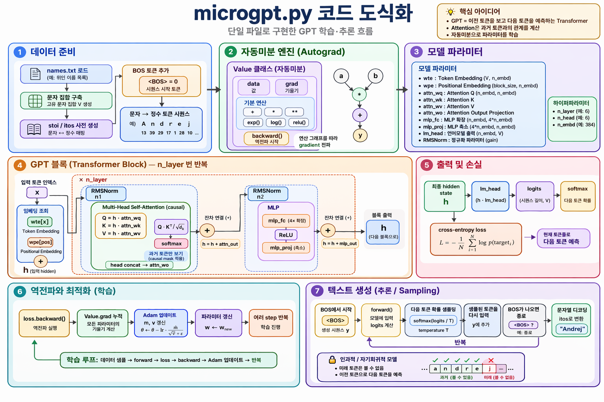

# 🧠 microgpt.py 코드 도식화 — 고등학생을 위한 상세 설명

> Andrej Karpathy의 [microgpt.py](https://gist.github.com/karpathy/8627fe009c40f57531cb18360106ce95)를 7단계로 분해한 아키텍처 다이어그램입니다.
> **200줄짜리 순수 파이썬 코드**로 ChatGPT의 핵심 원리를 직접 구현합니다.



---

## 💡 핵심 아이디어 — "다음에 뭐가 올까?"

ChatGPT가 하는 일은 사실 아주 단순합니다:

> **"지금까지 나온 글자(토큰)를 보고, 다음 글자를 예측하는 것"**

```
입력: "대한민국의 수도는"
예측: "서울" (92%), "부산" (3%), "대전" (1%), ...
```

우리의 MicroGPT도 똑같은 원리입니다. 다만 **문장** 대신 **이름**을 생성합니다:

```
입력: e → m → m → ?
예측: a (높은 확률) → "emma" 완성!
```

**3줄 요약:**
- **GPT** = 이전 토큰을 보고 다음 토큰을 예측하는 Transformer
- **Attention** = "어떤 글자가 지금 중요한지" 판단하는 메커니즘
- **자동미분** = 모델이 스스로 실수를 고치며 학습하는 방법

---

## 1단계: 데이터 준비 — 모델에게 먹일 재료 🥗

### 뭘 하는 단계인가요?

컴퓨터는 글자를 직접 이해하지 못합니다. **숫자만** 처리할 수 있어요!
그래서 이름 데이터를 읽어와서 숫자로 변환하는 준비 과정이 필요합니다.

### 구체적인 과정

1. **데이터 로드**: `names.txt` 파일에서 32,000개의 영어 이름을 읽어옴
   - emma, olivia, sophia, ava, isabella, ...

2. **문자 집합 구축**: 데이터에 나오는 모든 글자를 모아서 번호를 매김
   ```
   a=0, b=1, c=2, d=3, e=4, ... z=25
   ```

3. **BOS 토큰 추가**: "이름의 시작/끝"을 알려주는 특별한 신호
   ```
   BOS = 26  (Beginning of Sequence)
   ```

4. **토큰화**: 이름을 숫자 시퀀스로 변환
   ```
   "emma" → [26, 4, 12, 12, 0, 26]
             BOS  e   m   m  a  BOS
             시작                 끝
   ```

### 🍔 비유로 이해하기

> 요리사(모델)에게 레시피(이름 규칙)를 가르치려면, 먼저 요리 재료(글자)를 잘 정리해야 합니다.
> "사과"를 "재료 #7"로 번호를 매기는 것처럼, "a"를 "0번"으로 매기는 거예요.

---

## 2단계: 자동미분 엔진 (Autograd) — 마법의 계산기 🔮

### 뭘 하는 단계인가요?

모델이 학습하려면 "내가 얼마나 틀렸는지"를 알아야 하고, "어떤 숫자를 바꾸면 더 잘 맞출 수 있는지"도 알아야 합니다. 이걸 자동으로 계산해주는 게 **자동미분 엔진**입니다.

### Value 클래스 — 똑똑한 숫자 상자

일반 숫자 `3.0`과 달리, `Value(3.0)`은 **자신이 어떤 계산에 사용됐는지 기억**합니다.

```python
a = Value(2.0)   # 숫자 2.0을 Value로 감쌈
b = Value(3.0)   # 숫자 3.0을 Value로 감쌈
c = a * b        # c = 6.0 (그리고 "a와 b를 곱해서 만들었다"는 것도 기억!)
L = c + a        # L = 8.0
```

`backward()`를 호출하면 **체인룰**로 각 값의 영향력을 자동 계산합니다:

```python
L.backward()
print(a.grad)  # 4.0 → "a를 1 올리면 L이 4 올라감"
print(b.grad)  # 2.0 → "b를 1 올리면 L이 2 올라감"
```

### 지원하는 연산들

| 연산 | 코드 | 예시 |
|---|---|---|
| 더하기 | `a + b` | `2 + 3 = 5` |
| 곱하기 | `a * b` | `2 × 3 = 6` |
| 거듭제곱 | `a ** n` | `2² = 4` |
| 지수함수 | `a.exp()` | `e² ≈ 7.39` |
| 로그 | `a.log()` | `ln(2) ≈ 0.69` |
| ReLU | `a.relu()` | `max(0, x)` — 음수면 0, 양수면 그대로 |

### 🚗 비유로 이해하기

> 자동차가 자전거보다 **2배** 빠르고, 자전거가 걷는 사람보다 **4배** 빠르면,
> 자동차는 걷는 사람보다 **2 × 4 = 8배** 빠릅니다.
>
> 이것이 **체인룰(Chain Rule)**! "변화율을 따라 곱해나가는 것"입니다.
> Value 클래스가 이 곱셈을 자동으로 해줍니다.

---

## 3단계: 모델 파라미터 — 모델의 "뇌" 🧠

### 뭘 하는 단계인가요?

파라미터는 모델이 가진 **지식**입니다. 처음에는 랜덤한 숫자이지만, 학습을 통해 점점 의미 있는 값으로 변해갑니다. 사람으로 치면 "뇌의 시냅스 연결 강도"와 같습니다.

### 파라미터 목록

| 파라미터 | 크기 | 쉬운 설명 |
|---|---|---|
| `wte` | 27 × 16 | **단어장**: 각 글자(27개)를 16차원 벡터로 표현 |
| `wpe` | 16 × 16 | **자리표**: 각 위치(최대 16자리)를 16차원 벡터로 표현 |
| `attn_wq` | 16 × 16 | **질문 생성기**: "나는 어떤 정보가 필요해?" |
| `attn_wk` | 16 × 16 | **열쇠 생성기**: "나는 이런 정보를 가지고 있어" |
| `attn_wv` | 16 × 16 | **값 생성기**: "내가 전달할 실제 정보는 이거야" |
| `attn_wo` | 16 × 16 | **출력 변환기**: 어텐션 결과를 정리 |
| `mlp_fc` | 64 × 16 | **확장**: 정보를 4배로 펼쳐서 복잡한 패턴 학습 |
| `mlp_proj` | 16 × 64 | **축소**: 다시 원래 크기로 압축 |
| `lm_head` | 27 × 16 | **예측기**: 다음 글자 27개 중 뭐가 올지 점수 매김 |

### 하이퍼파라미터 — 모델의 "설계도"

| 설정 | 값 | 쉬운 설명 |
|---|---|---|
| `n_embd` | 16 | 각 글자를 표현하는 숫자 개수 (ChatGPT는 12,288개!) |
| `n_head` | 4 | 동시에 4가지 관점에서 바라봄 |
| `n_layer` | 1 | 생각의 깊이 (GPT-4는 100개 이상!) |
| `block_size` | 16 | 한번에 볼 수 있는 최대 글자 수 |

**우리 모델: 4,192개** vs **GPT-4: 수천억 개** — 크기는 다르지만 원리는 동일!

### 📦 비유로 이해하기

> 파라미터는 **조리법의 양념 비율**과 같습니다.
> - 처음에는 소금 3g, 설탕 5g 등 대충 넣지만
> - 사람들의 "맛있다/맛없다" 피드백(loss)을 받으며
> - 점점 최적의 비율을 찾아갑니다
> - 4,192개의 양념 비율을 동시에 조절하는 거예요!

---

## 4단계: GPT 블록 (Transformer Block) — 생각의 과정 🤔

### 뭘 하는 단계인가요?

이 단계가 GPT의 **핵심**입니다. 입력된 글자들을 분석하고, "다음에 뭐가 와야 하는지" 추론합니다.
Transformer Block은 크게 **두 부분**으로 나뉩니다.

### Part A: Multi-Head Self-Attention — "누구한테 집중할까?" 👀

#### 쉬운 설명

문장에서 **어떤 글자가 지금 중요한지** 판단하는 과정입니다.

예를 들어 `"emm"` 다음에 올 글자를 예측한다면:
- "첫 번째 `e`가 중요할까, 아니면 `m`이 중요할까?"
- 영어 이름에서 `emm` 다음에는 `a`가 많이 오므로 → `e`와 `m` 모두 참고!

#### Q, K, V — 도서관 비유 📚

| 요소 | 역할 | 비유 |
|---|---|---|
| **Q** (Query) | "나는 이런 정보가 필요해!" | 도서관에서 "영어 소설 찾아주세요" 하고 질문하는 것 |
| **K** (Key) | "나는 이런 정보를 가지고 있어" | 각 책의 라벨: "영어", "소설", "SF" 등 |
| **V** (Value) | "실제 전달할 내용" | 책의 실제 내용 |

**작동 과정:**
1. 현재 위치의 글자가 Q(질문)를 만듦
2. 이전 모든 글자들이 K(열쇠)를 만듦
3. Q와 K를 비교해서 **유사도 점수** 계산: $Q \cdot K^T / \sqrt{d_k}$
4. 점수가 높은 글자의 V(값)를 더 많이 가져옴

#### Multi-Head — "여러 관점으로 보기"

4개의 Head가 각각 **다른 관점**으로 분석합니다:
- Head 1: "바로 앞 글자와의 관계" 중점
- Head 2: "모음/자음 패턴" 중점
- Head 3: "이름의 시작 부분과의 관계" 중점
- Head 4: "전체적인 흐름" 중점

(실제로는 학습을 통해 자동으로 역할이 정해집니다)

#### Causal Mask — "미래는 볼 수 없다" 🚫

```
예시: "e m m a" 에서 각 글자가 볼 수 있는 범위

e를 처리할 때: [e] ← 자기만 봄
m을 처리할 때: [e, m] ← 앞의 e도 봄
m을 처리할 때: [e, m, m] ← 앞의 e, m도 봄  
a를 처리할 때: [e, m, m, a] ← 앞의 모든 글자를 봄
```

> 시험 볼 때 **앞 문제의 답은 참고할 수 있지만, 뒷 문제는 못 보는 것**과 같습니다!

#### 잔차 연결 (Residual Connection)

어텐션의 결과를 원래 입력에 **더합니다**: `h = h + attn_out`

> 선생님이 새로운 내용을 가르칠 때, 이전에 배운 것을 **잊지 않고** 위에 쌓아가는 것과 같습니다.

---

### Part B: MLP (Feed-Forward Network) — "깊이 생각하기" 💭

#### 쉬운 설명

Attention이 "어떤 글자가 중요한지" 파악했다면, MLP는 그 정보를 바탕으로 **더 복잡한 패턴을 학습**합니다.

#### 작동 과정

```
입력 (16차원) → 확장 (64차원) → ReLU → 축소 (16차원)
```

1. **mlp_fc** (확장): 16개의 숫자를 64개로 늘림 — "다양한 각도에서 분석"
2. **ReLU**: 음수는 0으로 만듦 — "관련 없는 정보는 버리기"
   ```
   ReLU(5) = 5    ← 양수는 그대로
   ReLU(-3) = 0   ← 음수는 0으로 제거!
   ```
3. **mlp_proj** (축소): 64개를 다시 16개로 줄임 — "핵심만 남기기"
4. **잔차 연결**: `h = h + mlp_out`

### 🏭 비유로 이해하기

> **Attention** = 회의에서 "누구 말을 들을지" 결정하는 것
> **MLP** = 들은 내용을 바탕으로 "내 의견을 정리"하는 것
> **잔차 연결** = "원래 알고 있던 것 + 새로 알게 된 것" 합치기

---

## 5단계: 출력 및 손실 — "맞았나 틀렸나?" 📊

### 뭘 하는 단계인가요?

모델이 예측한 결과가 **정답과 얼마나 다른지** 점수를 매기는 단계입니다. 이 점수를 **loss(손실)**라고 합니다.

### 구체적인 과정

1. **logits 계산**: 최종 hidden state에 `lm_head`를 곱해서 27개 글자 각각의 점수를 매김
   ```
   "emm" 다음 글자 예측:
   a: 8.5점, b: 1.2점, c: 0.3점, ... z: 0.1점
   ```

2. **softmax**: 점수를 확률로 변환 (모두 합하면 100%)
   ```
   a: 73%, b: 5%, c: 2%, ... z: 0.1%
   ```

3. **Cross-Entropy Loss**: 정답의 확률이 높을수록 loss가 낮음

   $$L = -\frac{1}{N} \sum_{i=1}^{N} \log p(\text{target}_i)$$

   ```
   정답이 'a'이고 모델이 a를 73%로 예측 → loss = -log(0.73) = 0.31 (낮음 ✅)
   정답이 'a'인데 모델이 a를 5%로 예측 → loss = -log(0.05) = 3.00 (높음 ❌)
   ```

### 🎯 비유로 이해하기

> 수학 시험에서 **오답이 많을수록 점수가 낮은 것**과 같습니다.
> - loss가 높다 = "많이 틀렸다" → 더 공부해야 함
> - loss가 낮다 = "거의 맞았다" → 잘 하고 있음!

---

## 6단계: 역전파와 최적화 (학습) — "실수에서 배우기" 📈

### 뭘 하는 단계인가요?

5단계에서 "얼마나 틀렸는지"를 알았으니, 이제 **파라미터를 조금씩 수정해서 다음엔 더 잘 맞추도록** 합니다. 이게 바로 "학습"입니다!

### 역전파 (Backward) — "누구 때문에 틀렸지?"

`loss.backward()`를 실행하면, 4,192개의 파라미터 각각에 대해 **"이 숫자를 올리면 loss가 올라가나 내려가나?"**를 계산합니다.

```
파라미터 #1의 grad = +0.5 → "이 값을 올리면 loss가 올라감" → 내려야 함!
파라미터 #2의 grad = -0.3 → "이 값을 올리면 loss가 내려감" → 올려야 함!
```

### Adam 옵티마이저 — "똑똑한 파라미터 업데이트"

단순히 grad 방향으로 움직이는 게 아니라, **지금까지의 경향(모멘텀)**을 고려해서 더 부드럽게 업데이트합니다.

$$\theta \leftarrow \theta - \text{lr} \cdot \frac{\hat{m}}{\sqrt{\hat{v}} + \epsilon}$$

쉽게 말하면:
- **m (1차 모멘텀)**: "최근에 주로 어느 방향으로 갔지?" — 방향 기억
- **v (2차 모멘텀)**: "최근에 얼마나 큰 폭으로 변했지?" — 진동 방지
- **lr (학습률)**: "한 번에 얼마나 크게 움직일까?" — 0.01 (조심히!)

### 학습 루프 — 1,000번 반복!

```
1회차: loss = 3.29 (거의 랜덤 수준)
100회차: loss = 2.50 (패턴을 조금 배움)
500회차: loss = 2.10 (꽤 그럴듯한 이름 생성)
1000회차: loss = 1.95 (자연스러운 이름 생성!)
```

### ⛷️ 비유로 이해하기

> 눈을 감고 산에서 **가장 낮은 곳(골짜기)**을 찾아가는 것과 같습니다.
> - 발밑의 경사(grad)를 느껴서 "이쪽이 내리막이구나" 판단
> - 한 걸음(lr) 내디딤
> - 이걸 1,000번 반복하면 골짜기(최적 파라미터)에 도착!
>
> Adam은 "이전에 왔던 방향도 기억하면서" 걸어가는 똑똑한 등산객입니다.

---

## 7단계: 텍스트 생성 (추론 / Sampling) — "새 이름 만들기!" ✨

### 뭘 하는 단계인가요?

학습이 끝난 모델로 **새로운 이름을 만들어내는** 단계입니다. 학습 데이터에 없는 완전히 새로운 이름이 탄생합니다!

### 구체적인 과정

```
1. BOS(시작) 토큰 입력
2. 모델이 다음 글자 확률 계산: k(30%), a(20%), m(15%), ...
3. 확률에 따라 하나를 뽑음 → 'k'
4. 'k'를 다시 입력
5. 모델이 또 다음 글자 확률 계산: a(40%), i(25%), ...
6. 뽑음 → 'a'
7. 반복...
8. BOS(끝) 토큰이 나오면 종료!

결과: "kaelyn" 🎉
```

### Temperature — "창의성 조절 다이얼" 🎛️

Temperature `T` 값으로 생성의 **보수적 ↔ 창의적** 정도를 조절합니다:

| Temperature | 효과 | 결과 예시 |
|---|---|---|
| **T = 0.1** (낮음) | 가장 확률 높은 글자만 선택 (보수적) | `emma`, `anna` — 흔한 이름 |
| **T = 0.5** (중간) | 적당한 다양성 | `kaelyn`, `mira` — 자연스러운 새 이름 |
| **T = 1.5** (높음) | 낮은 확률의 글자도 선택 (모험적) | `xqvzl`, `jrwp` — 이상한 조합 |

```python
# Temperature 적용
probs = softmax([logit / T for logit in logits])
# T가 낮으면 → 확률 차이가 극대화 → 1등만 뽑힘
# T가 높으면 → 확률이 비슷해짐 → 아무나 뽑힐 수 있음
```

### 인과적 / 자기회귀적 모델 — "순서대로 한 글자씩"

GPT는 **한 번에 한 글자씩**, **왼쪽에서 오른쪽으로** 생성합니다:

```
... a  n  d  r  e  | j  _  ...
    ✅ ✅ ✅ ✅ ✅ | ❌ ❌
    (과거: 볼 수 있음) (미래: 볼 수 없음)
```

> 소설을 쓸 때 **이미 쓴 부분은 참고할 수 있지만, 아직 안 쓴 부분은 모르는 것**과 같습니다!

### 🎲 비유로 이해하기

> **주사위 던지기**와 비슷하지만, **치우친 주사위**입니다.
> - 모델이 "다음은 'a'가 올 확률 70%, 'e'가 올 확률 20%..." 식으로 주사위를 만듦
> - Temperature가 낮으면 → 거의 항상 'a'가 나오는 주사위
> - Temperature가 높으면 → 어떤 글자든 나올 수 있는 공정한 주사위

---

## 📐 전체 흐름 한눈에 보기

```
[이름 데이터] → [숫자로 변환] → [모델에 입력]
                                    ↓
                              [임베딩 변환]
                                    ↓
                            [Attention: 중요한 글자 파악]
                                    ↓
                            [MLP: 패턴 분석]
                                    ↓
                            [다음 글자 확률 예측]
                                    ↓
                    ┌──── 학습 모드 ────┐ ┌──── 생성 모드 ────┐
                    │ 정답과 비교(loss)  │ │ 확률대로 글자 뽑기 │
                    │ 역전파 → 파라미터  │ │ → 새로운 이름 완성  │
                    │ 업데이트 → 반복!  │ │   예: "kaelyn"     │
                    └──────────────────┘ └──────────────────┘
```

---

## 🔑 핵심 용어 정리

| 용어 | 쉬운 설명 |
|---|---|
| **토큰 (Token)** | 모델이 처리하는 기본 단위. 여기서는 글자 하나 |
| **임베딩 (Embedding)** | 글자를 숫자 벡터(리스트)로 표현한 것 |
| **어텐션 (Attention)** | "어떤 글자가 지금 중요한지" 계산하는 메커니즘 |
| **RMSNorm** | 숫자들의 크기를 일정하게 맞춰주는 정규화 |
| **ReLU** | 음수는 0으로, 양수는 그대로 보내는 활성화 함수 |
| **잔차 연결 (Residual)** | 새 정보 + 원래 정보를 더해서 학습을 안정화 |
| **Loss** | 모델의 예측이 정답과 얼마나 다른지 측정하는 점수 |
| **역전파 (Backward)** | loss에서 시작해 각 파라미터의 영향력을 역으로 계산 |
| **Adam** | 파라미터를 똑똑하게 업데이트하는 최적화 알고리즘 |
| **Temperature** | 생성의 랜덤성을 조절하는 값 (낮으면 보수적, 높으면 창의적) |
| **Softmax** | 점수를 확률(합이 100%)로 변환하는 함수 |

---

## 🤔 자주 하는 질문

**Q: 이게 진짜 ChatGPT랑 같은 원리인가요?**
> A: 네! ChatGPT도 "다음 토큰 예측"이라는 동일한 원리입니다. 차이는 **규모**뿐입니다.
> - MicroGPT: 파라미터 4,192개, 글자 단위, 이름 생성
> - GPT-4: 파라미터 수천억 개, 서브워드 단위, 거의 모든 텍스트 생성

**Q: 200줄로 정말 가능한가요?**
> A: Karpathy의 원래 코드는 정확히 200줄입니다. 핵심 알고리즘만 남기고 효율성 관련 코드를 모두 제거한 것이죠. Karpathy의 말처럼: *"이 파일이 알고리즘의 전부입니다. 나머지는 모두 효율성의 문제입니다."*

**Q: 왜 이름을 생성하나요? 문장은 안 되나요?**
> A: 이름은 짧고 패턴이 단순해서 작은 모델로도 학습 가능합니다. 문장을 생성하려면 훨씬 큰 모델과 데이터가 필요합니다.
